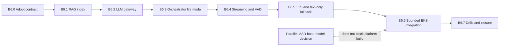

# PLAN-2026-013 - Full B6 serving implementation

Status: **PROPOSED - NOT EXECUTION AUTHORIZATION**

Prepared: 2026-08-08

Starting point: unified `master` at `20b4b4fdcbe42477907838ec01ed616e92f05149`

Budget authority: `$300` aggregate ceiling; current guardrail registry is
`platform/finance/COST-REGISTRY-2026-001.json`.

This plan adapts Base-v5 B6 to the facts proven since the original plan:

- B6A closed the model-loader -> ASR-runtime path with zero-shot Whisper
  large-v3 v0, one synthetic transcription and measured L4 memory.
- v0 remains a platform-test model. B5 remains `BLOCKED`; no language has an
  approved fine-tuned model.
- `speech-orchestrator`, `llm-gateway`, `rag-index` and this repository's
  `tts-gateway` are not implemented.
- Green Bucket now contains 952.82 training hours across 11 languages and
  44.15 FLEURS evaluation hours, but no language is reactivated by this plan.
- CPU and GPU desired capacity are both zero for planning and local builds.

The original B6 exit conditions remain the target: all services Ready, one
orchestrator-only ingress path, a green file/WebSocket contract suite, complete
request/model traceability, and failure drills that degrade without cascades.

## Recommended sequence

## 1. Contract adoption first

Base-v5 names an external `section 7-v4`, but that specification is absent
from the repository and supplied PDFs. The prospective replacement is
`platform/contracts/speech-v1.yaml`; B6A implemented only its internal ASR
subset.

Before building another service, the owner must do one of the following:

1. adopt `MEDZEN-SPEECH-CONTRACT-2026-001` as the full-B6 canonical contract;
   or
2. supply section 7-v4, reconcile every difference prospectively, and publish
   a new version.

The adoption PR must freeze:

- file-mode and WebSocket paths, event ordering and close/error codes;
- request-id, session-id and complete model-version envelopes;
- verbatim/normalized transcript behavior;
- authentication and maximum payload sizes;
- text-only as a successful TTS outcome;
- 250 ms cancel/barge-in propagation;
- PHI-safe logging fields; and
- compatibility/versioning rules for MedZen backend clients.

It must also add OpenAPI/AsyncAPI-derived schemas, golden request/response
fixtures, provider mocks and consumer-driven tests. No remaining service build
starts until those fixtures are green. This is a contract decision, not an AWS
packet.

Exit: owner-approved contract record and a local contract suite that both the
MedZen backend and service stubs can consume.

## 2. Build order

### B6.1 - RAG index, local only

Build the smallest read-only retrieval service first because the LLM gateway
depends on its response schema. Use synthetic/non-clinical fixtures until a
clinical owner approves content. Implement versioned index identity, alias
resolution, citation metadata, health/readiness, empty-index refusal and
rollback tests.

Exit: deterministic retrieval contract and alias rollback pass locally. No
claim that clinical content is approved.

### B6.2 - LLM gateway, local/mocked first

Implement the Bedrock-facing boundary, language policy loading, RAG citation
binding, request/model identity, timeouts and breaker behavior. Use a fake
Bedrock upstream for the complete local suite. A real Bedrock call requires a
versioned packet with a request and token cap.

Exit: cited reply contract, safety refusal paths and breaker tests pass without
AWS.

### B6.3 - Orchestrator file-mode text slice

Build authentication, session/request identity, registry routing, emergency
check, ASR -> RAG/LLM flow and text-only response assembly. This produces the
first complete conversation without waiting for TTS.

Exit: one synthetic file request returns transcript, cited reply, text-only TTS
status and every model/registry version; no body is logged.

### B6.4 - Streaming, VAD and resilience

Add Silero VAD behind an interface, WebSocket sessions, bounded queues,
sequence rules, backpressure, cancellation, barge-in, timeouts and circuit
breakers. Final transcripts and clinical answers are never dropped.

Exit: contract tests prove partial queue size 4, audio queue size 8, final-result
preservation, 250 ms cancellation, slow-client control and clean disconnects.

### B6.5 - New TTS gateway

Build `medzen-speech-tts-gateway` in this repository; do not reuse or modify the
separately owned `medzen-tts-gateway`. Start with the successful text-only path,
then add Fish behind content-hash idempotency and the provider breaker.
Self-hosted TTS remains absent until a voice/model is registry-approved.

Exit: Fish success and timeout/error both preserve the text response; the
failure path reports `tts_backend=text_only` with no 500 cascade.

### B6.6 - Bounded EKS integration

After all local exits, present an itemized AWS packet. Deploy in dependency
order: RAG, retained B6A ASR v0, TTS, LLM, orchestrator. Only the orchestrator
may receive an internal ALB route; every dependency remains ClusterIP. Admit
only the exact MedZen backend security-group source. Use synthetic audio and no
production traffic.

Exit: every pod Ready, one end-to-end file request and one WebSocket turn pass,
ASR/TTS/LLM/RAG are unreachable externally, and CPU/GPU return to zero after
the window.

### B6.7 - Drills, soak and closure

Run the bounded drills below. A separate packet is required for any 24-hour
soak because it creates sustained cost. B6 closes only after receipts, cost
reconciliation and zero-state cleanup are independently reviewed.

## 3. Per-service IAM boundary

All policies are generated from `platform/services.yaml`, tested locally and
independently reviewed before an AWS packet. One Kubernetes service account
maps to one Pod Identity role; no static credentials or shared application
role is allowed.

| Workload | Minimum access | Required denials / limits |
|---|---|---|
| orchestrator | registry read; exact audio-cache/user-audio prefixes; client-key secret read | no Bedrock, model artifact or content access; no broad S3 list |
| RAG | owner-approved `content/*` read and prefix-scoped list | no writes, registry, secrets or Bedrock |
| LLM | exact Bedrock inference-profile invoke; registry read | no S3, secrets or model artifact access |
| TTS | exact Fish secret; registry read; `audio-cache/tts/*` read/write | no user-audio, content, model or Bedrock access |
| ASR pod | exact bound v0 test prefix for B6; future `approved/asr/*` only after a separate B5 PASS | no write, registry, secrets or production alias change |

Important correction: the model-loader init container and ASR runtime share a
Pod service account and therefore share Pod Identity credentials. Full B6 must
not claim per-container IAM isolation that Kubernetes does not provide. The
recommended design is one narrow, read-only ASR-pod role; keep the separate
loader role unused unless loading becomes a separate Job with its own service
account.

Each policy test must prove allowed actions, cross-prefix denial, write denial,
wrong-region/account refusal and that the trainer cannot assume or use a
serving role.

## 4. Required failure drills

All drills use synthetic/no-PHI traffic and per-stage durable receipts.

1. Fish unavailable/timeout -> text-only success; no self-hosted claim.
2. ASR pod killed mid-stream -> bounded session error, no hang or partial final.
3. LLM breaker opened -> controlled unavailable response, no retry-generated
   second clinical answer.
4. RAG alias missing/stale -> fail closed; never answer uncited clinical facts.
5. Registry value malformed/stale -> readiness false and no silent default.
6. Model checksum mismatch -> init failure and pod never Ready.
7. Slow client -> bounded memory, partials may drop, final answer never drops.
8. Cancel and barge-in -> ASR/LLM/TTS work ends within 250 ms.
9. Network isolation -> only orchestrator route is reachable from the backend;
   all model services reject external reachability.
10. Rollback -> previous content/config alias restored without rebuilding an
    image.

Exit: every drill has an expected state/event code, no 500 cascade, no PHI in
logs, full request-id trace and complete cleanup receipts.

## 5. Cost model and packet boundaries

Current official AWS catalog values used for planning:

- EKS standard cluster: `$0.10/hour` (about `$73/month` at 730 hours), billed
  even with worker nodes at zero;
- `m6i.large` CPU node: `$0.115/hour`; two-node test posture is `$0.23/hour`;
- recorded `g6.xlarge` GPU rate: `$1.0064/hour`.

Therefore a two-CPU-plus-one-GPU integration window is about `$1.2364/hour`
before storage, logs, network, Bedrock and Fish. A four-hour compute window is
about `$4.9456`; reserve `$10` only after exact variable-request limits are in
the packet. A continuous 24-hour soak is about `$29.6736` compute and must have
its own packet/reservation rather than hiding inside an integration window.

Controls:

- local build/test first with CPU=0 and GPU=0;
- one active billable packet/reservation at a time;
- every packet names a cost-registry allocation id and exact allocation tags;
- CPU/GPU deadline and cleanup are armed before scale-up;
- Bedrock/Fish request, token and audio-duration ceilings are explicit;
- actual billing is reconciled into a new cost-registry revision; and
- no new AWS resource, IAM change, ALB, standing cost or production SSM write
  occurs without a versioned packet and required review.

The current `$237.4712` is guardrail headroom after reservations, not verified
actual remaining spend.

## 6. Parallel ASR base-model decision

Do not couple platform completion to a new training campaign. Retain Whisper
large-v3 v0 as the B6 test control while a separate, no-training decision track
uses the Green Bucket assets.

The track must:

1. validate licences, checksums, audio/transcript quality, speaker/session split
   isolation and non-overlap between `gb1` training and `fleurs-v1` evaluation;
2. identify which deferred languages now meet their prospective reactivation
   condition; Acholi, Akan and Ewe still lack FLEURS in the current handoff;
3. freeze one common zero-shot evaluation protocol and compare Whisper
   large-v3 with an owner-approved multilingual alternative shortlist;
4. compare per-language WER/CER, code-switch behavior, normalization/tokenizer
   fit, licence, L4 memory/latency, conversion/runtime support and projected
   training cost; and
5. publish `B6-ASR-BASE-MODEL-2026-001` before any training packet.

No language is silently reactivated. More hours change the evidence available
for a prospective decision; they do not alter the immutable B4/B5 records or
the existing deferral decision.

## Full-B6 closure gate

Full B6 is complete only when:

- the adopted contract and all consumer/provider suites pass;
- the four missing services are implemented, scanned and immutably identified;
- all pods become Ready in a bounded deployment;
- only the orchestrator is reachable from the MedZen backend;
- file and streaming turns carry request id plus all model versions;
- all failure drills pass without cascades;
- receipts and traces are PHI-safe;
- actual costs are reconciled; and
- CPU/GPU capacity and temporary workloads return to zero.

B6 completion still does not make the B5 candidate promotable, approve any
deferred language or authorize B7 production CI/CD.

## Change coordination

- Owner: adopts the contract and approves each AWS packet.
- MedZen backend consumer: reviews golden file/WebSocket fixtures before build.
- Independent architecture/IAM reviewer: reviews service roles and each
  standing-cost or IAM packet.
- Clinical content owner: approves content before RAG integration claims.
- Team update points: contract adopted; each local service exit; AWS packet
  ready; integration complete; drills complete; B6 closure review.
