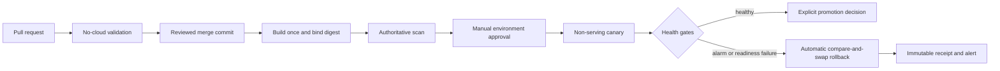

# PLAN-2026-014 - B7 CI/CD and canary rollback

Status: **PROPOSED - PLANNING REVIEW ONLY - NOT EXECUTION AUTHORIZATION**

Prepared: 2026-08-11

Unified starting Git commit: `e04a4140491d7a5d0a389403bcc3c20eed3ca713`

B6 closure merge ancestor: `7bbec6ed173fdf3b02d4038312cf4cdf5aa12d7b`

Repository: private `github.com/fotso94/medzen-platform`

Governing B6 closure record:
`platform/evidence/B6-CLOSURE-2026-001.json`, SHA-256
`8f174c2ad41782ca3cb1300d9c888aac373487422c66b543f6ce8aa90a45d299`.

Cost authority: `COST-REGISTRY-2026-006`, recognized committed guardrail
`$74.4286064216`, active reservations `$0`, guardrail headroom
`$225.5713935784` under the unchanged `$300` aggregate ceiling.

## 1. Purpose and current boundaries

This plan adapts Base-v5 B7 to the platform that B6 actually proved. It
defines the four CI/CD pipelines and a canary rollback drill. It authorizes no
GitHub setting change, AWS mutation, production deployment, registry alias
change, model registration, approved artifact publication or spend.

The following facts govern every B7 implementation step:

- B6 is formally complete under its independently accepted closure record.
- B5 remains `BLOCKED`; registered models and approved ASR artifacts remain
  zero. No CI workflow may turn the B5 artifact into a promotion.
- `/medzen/registry/serving/current` remains absent and production traffic is
  zero. B7 must not create either as a side effect of testing automation.
- CPU and GPU desired capacity are zero. They stay zero during local workflow
  engineering.
- `.github/workflows/` is currently absent. B7 starts from no executable
  GitHub Actions pipeline rather than assuming CI already exists.
- Terraform locates the GitHub OIDC provider, but no reviewed CI roles are
  defined and `github_repo` still defaults to `REPLACE/medzen-platform`.
- Branch protection was previously unavailable on the repository's GitHub
  plan. Until that changes, merge-triggered AWS apply or production deployment
  is prohibited; protected GitHub environments with independent manual review
  are the compensating control.

The design follows GitHub's OIDC subject model for AWS and uses no long-lived
AWS keys. Every external action is pinned to a full commit SHA, workflow
permissions are explicit, and untrusted pull requests receive no cloud
identity.

## 2. Target flow

No workflow both builds a mutable image tag and deploys that tag. The build
stage records the OCI index, `linux/amd64` child digest, scan result, source
commit, dependency lock hashes and provenance. Every later stage accepts only
those immutable identities.

## 3. Shared workflow controls

All four workflows must implement these controls before their individual exit
conditions can pass:

1. Top-level `permissions: contents: read`; grant `id-token: write`,
   `packages: write`, `pull-requests: write` or other permissions only on the
   exact job that needs them.
2. No AWS credentials, cloud role or write-capable `GITHUB_TOKEN` on pull
   requests from forks or other untrusted contexts.
3. Pin every third-party and GitHub-authored action to a full 40-character
   commit SHA. Dependabot may propose updates, but review must see the old and
   new SHA.
4. Use concurrency groups so only one deployment, registry mutation, content
   alias change or Terraform apply can run at a time. A newer run must not
   cancel cleanup or rollback from an older run.
5. Build once. Promote the exact scan-passed child digest; never rebuild
   between test, canary and release.
6. Persist a write-once receipt after every stage, including refusals. Receipts
   bind workflow run id, triggering actor, commit, workflow-file hash, assumed
   role ARN, immutable inputs, outputs, timestamps and cleanup state.
7. Sanitize logs. Transcript, response, audio, secrets and model-provider
   payloads are forbidden. Synthetic test data follows the existing runtime
   receipt policy.
8. Unknown state, absent approval, missing evidence, hash drift, scan absence
   or timeout refuses the workflow. A skipped required job is not success.
9. No workflow may edit historical B4, B5 or B6 evidence. New records
   supersede by reference only.
10. Each AWS-touching step requires a versioned packet, independent review,
    exact owner approval, a cost allocation id and rollback instructions.

## 4. The four pipelines

### B7.1 - Application pipeline

Proposed workflow: `.github/workflows/application.yml`.

**Pull-request lane - no AWS:**

- install only pinned service requirements;
- run architecture, contract, unit, integration and behavioral suites;
- build every changed service for `linux/amd64` with the B6 runtime-image
  hardening standard;
- run container startup and contract smokes, including the real WebSocket
  conversation qualification added during B6;
- produce an SBOM and run the local vulnerability scanner; and
- prove generated IAM/Kubernetes files match `platform/services.yaml`.

**Release lane - AWS only after a packet:**

- assume a build role through the `b7-build` GitHub environment;
- push only to the exact service repositories;
- wait for the authoritative ECR scan of the `linux/amd64` child manifest;
- fail closed on any critical or high finding, with no implicit waiver;
- pass immutable digests to a separate `b7-deploy-test` environment/job;
- deploy only the packet-bound namespace and registry snapshot; and
- require `kubectl rollout status --timeout=10m`. Timeout fails the pipeline,
  leaves the cluster in a known prior or refusing state, and starts cleanup;
  it never declares a partial rollout successful.

Application rollback restores the exact prior deployment manifest and image
digest. It is not a model or content alias rollback.

Exit: the pull-request lane passes on a clean checkout; a packet-bound
non-serving release proves build -> scan -> digest-pinned deploy -> rollout
receipt -> exact rollback, followed by zero-state verification.

### B7.2 - Model pipeline

Proposed workflow: `.github/workflows/model.yml` with
`workflow_dispatch(run_id, track)`.

The current mode is **refusal-only**. It may verify the immutable B5 BLOCKED
report and demonstrate that promotion jobs remain unreachable. It may not
register a model, change MLflow stage, write `approved/asr/`, update
`approved_version`, create a production snapshot or start a canary.

A future promotion lane remains disabled until a prospective owner decision
binds all of the following before the run:

- a signed B5 `PASS` report and its exact gate version;
- an approved model manifest and artifact tree hash;
- MLflow run identity and allowed current stage;
- exact languages that passed, without reclassifying absent evidence;
- manual approver identity and timestamp; and
- the registry source commit that changes only authorized serving fields.

After those preconditions exist, the workflow verifies them read-only, opens a
registry PR, and stops. Merge of that PR may request a separate canary workflow;
it does not make registration or canary harmless. The existing dedicated
promotion boundary remains separate from general CI roles.

Exit now: the historical B5 artifact deterministically ends `BLOCKED`, with
zero registrations, approved objects, registry serving changes and deployments.
Future production exit: separately authorized signed PASS -> reviewed registry
PR -> canary -> automatic rollback drill.

### B7.3 - Content/RAG pipeline

Proposed workflow: `.github/workflows/content-rag.yml`.

- trigger only from a reviewed owner-approved content change;
- validate document identity, provenance, licence, effective dates, clinical
  owner approval and metadata schema;
- refuse clinical content that lacks approval or contains an unapproved source;
- build the index deterministically and bind the source tree, builder image,
  index hash, retrieval fixtures and citations;
- run deterministic retrieval, empty-index, stale-alias and citation tests;
- publish only an immutable candidate index under a content-addressed test
  path after a packet; and
- change an alias only in a separate manually approved job after read-back.

Rollback is an atomic compare-and-swap to the exact previous content alias. It
never rebuilds an index during an incident.

Exit: approved synthetic content proves build, retrieval and alias rollback in
the non-serving namespace. Production clinical publication remains blocked
until a clinical owner approves the actual content and an AWS packet is
reviewed.

### B7.4 - Infrastructure pipeline

Proposed workflow: `.github/workflows/infrastructure.yml`.

**Pull request:** `terraform fmt -check`, `init -backend=false`, validate,
policy/static checks and a read-only plan produced by an OIDC plan role. The
plan receipt binds state location, caller identity, commit, variable-file
hashes, plan SHA, add/change/destroy counts and resource names.

**Apply:** manual `workflow_dispatch` only while branch protection is
unavailable. The job must receive the reviewed plan SHA and exact commit, use
the `b7-infrastructure-apply` environment, require independent approval, and
refuse if a newly generated plan is not byte-equivalent in resource actions.
No apply-on-merge fallback is permitted.

**Nightly drift:** a read-only scheduled plan reports drift and opens evidence;
it never auto-applies or auto-destroys. An unchanged state is a successful
observation, not a reason to mutate infrastructure.

Exit: pull-request and drift lanes prove zero-write behavior; a later packet
qualifies the apply role and one deliberately reversible, non-production
change with exact rollback.

## 5. OIDC and role separation

The OIDC/IAM implementation is a separate, itemized AWS packet. One broad
`github-actions` role is prohibited. At minimum, design and simulate:

| Role | Purpose | Explicitly absent |
|---|---|---|
| `medzen-b7-plan-role` | read state and describe resources for plans/drift | apply, ECR push, EKS mutation, SSM write |
| `medzen-b7-build-role` | authenticate and push to exact ECR repositories | EKS, SSM, approved artifacts, IAM |
| `medzen-b7-deploy-test-role` | mutate only the reviewed test namespace and read scan-passed images | production SSM, approved paths, IAM, trainer access |
| `medzen-b7-content-publisher-role` | create immutable test content and perform exact test-alias compare-and-swap | ASR artifacts, model registry, production alias |
| `medzen-b7-infra-apply-role` | execute only a separately approved Terraform plan | assumption from unreviewed branches or jobs |
| `medzen-b7-rollback-role` | read one active alias and restore its recorded prior value | arbitrary SSM writes, artifact writes, image push, IAM |

Trust policies bind account `558069890522`, audience `sts.amazonaws.com`,
repository `fotso94/medzen-platform` and the exact protected GitHub environment
in the OIDC `sub`. AWS does not expose arbitrary custom GitHub OIDC claims, so
the design must not pretend that a workflow path can be enforced through an
unsupported claim. Workflow-file integrity is instead bound in the receipt and
reviewed commit, while the environment is the cloud trust boundary.

Before any role is created, policy tests and `simulate-principal-policy` must
cover every intended action plus wrong repository/environment, wrong account,
wrong region, unexpected prefix, overwrite, delete and privilege-escalation
cases.

## 6. Canary and automatic rollback

B7 has two deliberately separate rollback lanes:

1. **Application code:** Kubernetes restores the exact previous manifest and
   image digest after readiness, rollout or application-metric failure.
2. **Model/content/config:** the registry restores the exact previous immutable
   snapshot/alias. No image is rebuilt and no artifact is copied during
   rollback.

The current orchestrator supports one content-addressed route, not fractional
dual-route canaries. Before any traffic-fraction canary, a prospective registry
schema and routing PR must add:

- stable request/session assignment to control or candidate;
- language allowlist and an integer traffic percentage;
- immutable control/candidate snapshot hashes;
- a frozen routing salt and deterministic assignment test vectors;
- complete version reporting in every response and metric; and
- an emergency `0%` candidate setting that cannot delete the prior snapshot.

This routing change is local engineering first. It cannot activate production
or reactivate a language.

The alarm values are copied unchanged from `registry/gates/_defaults.yaml`:

- error rate greater than `2%` over `5 minutes`;
- p95 latency greater than `1.5x` the frozen baseline over `10 minutes`; or
- readiness failure.

Missing metrics never mean PASS. Before percentage increases, the canary must
have the predeclared minimum request count; insufficient traffic holds the
current fraction for manual review. Readiness failure remains immediate.

CloudWatch alarm state changes feed an exact EventBridge rule whose only target
is a versioned Systems Manager Automation rollback runbook. The runbook:

1. validates alarm ARN, environment, current alias, candidate hash, previous
   hash and approval receipt;
2. performs compare-and-swap only if the current alias still equals the
   candidate;
3. verifies the restored value with bounded stable observations;
4. is idempotent for duplicate EventBridge delivery;
5. persists PASS or REFUSED receipts before notification; and
6. refuses unknown state or evidence rather than choosing an alias.

The first live drill uses a non-serving test alias, synthetic traffic and an
injected alarm. It must prove the alarm, EventBridge event, runbook invocation,
exact prior-alias restoration, application health, receipt chain and cleanup.
A production drill is required before first production traffic, but cannot be
authorized while B5 is BLOCKED and the production serving pointer is absent.

## 7. Test strategy

### Fast local layer

- parse every workflow and require exact event, permission and concurrency
  boundaries;
- reject unpinned actions, mutable image tags and static AWS secrets;
- test path filters so a service change cannot silently skip its contract suite;
- test B5 BLOCKED, missing gate report and unknown status refusals;
- test deterministic index and registry snapshot generation twice by hash;
- test canary assignment determinism, percentage boundaries and language scope;
- test compare-and-swap rollback, duplicate events, wrong alias and wrong key;
- test PHI/log redaction and receipt-per-stage behavior; and
- test Terraform plan guards and unexpected create/change/destroy refusal.

### GitHub qualification layer

- fork/untrusted PR receives no OIDC token and no write-capable repository token;
- environment job cannot start without the required reviewer;
- actor, commit and workflow hashes appear in receipts;
- cancelled and superseded runs cannot cancel cleanup; and
- build artifacts remain identical between scan and deployment.

### AWS qualification layer - packet required

- IAM simulation for every role and explicit denial family;
- ECR child-manifest scan gate and digest-pinned deployment;
- test-namespace rollout timeout and exact application rollback;
- non-serving registry/content alias automatic rollback drill; and
- stable proof that production SSM, `approved/asr/`, MLflow registry and
  deferred-language serving fields are unchanged.

## 8. Delivery order and review points

1. **B7.0 - plan adoption:** review this document and choose the compensating
   GitHub controls while branch protection is unavailable.
2. **B7.1 - local workflows:** add all four workflow files, local guard scripts,
   mocks and tests. No OIDC and no AWS writes.
3. **B7.2 - OIDC packet:** present exact trust policies, role policies, policy
   simulations, GitHub environments and rollback. Near-zero cost, but IAM and
   repository settings require independent review.
4. **B7.3 - scan/deploy qualification packet:** push a harmless application
   revision, scan by child digest, deploy only to a non-serving namespace, and
   roll back to zero.
5. **B7.4 - canary engineering:** add dual-route registry schema, deterministic
   routing, alarms and runbook locally; run the non-serving rollback drill only
   after its own packet.
6. **B7.5 - production enablement:** blocked until B5 PASS, an approved model or
   clinical content candidate, production registry authorization, branch or
   equivalent merge protection, and a fresh cost registry/reservation.

Team updates are required at plan adoption, four local pipelines green, IAM
packet ready, OIDC qualification complete, non-serving rollback drill complete
and final B7 engineering review.

## 9. Completion semantics

For the current project state, successful B7 work must be reported in two
parts:

- `B7_ENGINEERING_READY`: four pipelines, policy tests and a non-serving
  canary/rollback drill are complete and reviewed.
- `B7_PRODUCTION_AUTOMATION_BLOCKED`: no production pipeline is enabled because
  B5 is BLOCKED, the production serving pointer is absent, and no production
  candidate has been approved.

B7 must not be described as production release readiness merely because its
automation code is implemented.

## 10. Sources and deviations

Sources:

- `MedZen_Speech_Platform_Base_v5.pdf`, page 6, B7 and canary requirements.
- GitHub OIDC for AWS:
  `https://docs.github.com/actions/how-tos/secure-your-work/security-harden-deployments/oidc-in-aws`.
- GitHub Actions hardening:
  `https://docs.github.com/code-security/tutorials/secure-your-organization/protect-against-threats`.
- CloudWatch alarm events:
  `https://docs.aws.amazon.com/AmazonCloudWatch/latest/monitoring/cloudwatch-and-eventbridge.html`.
- EventBridge Systems Manager targets:
  `https://docs.aws.amazon.com/systems-manager/latest/userguide/monitoring-systems-manager-targets.html`.

Deviations from Base-v5:

1. **No apply-on-merge yet.** Base-v5 assumes a protected branch. The current
   repository plan does not provide branch protection, so infrastructure apply
   remains manual-dispatch plus protected-environment approval.
2. **Model workflow is refusal-only now.** Base-v5 assumes a passable staged
   model. B5 is BLOCKED and registration is forbidden, so the current workflow
   proves refusal rather than adoption.
3. **Canary routing needs implementation.** Base-v5 describes language or
   fractional routing, but the B6 registry/orchestrator currently resolves one
   route. Fractional canary support is a prospective schema/code change.
4. **Separate application and registry rollback lanes.** This prevents a code
   rollout failure from mutating a model/content alias and preserves the
   registry-only model rollback principle.
